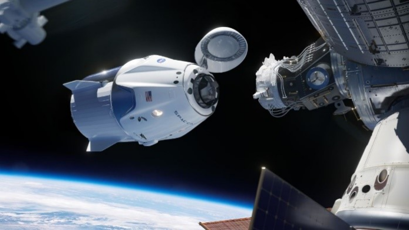
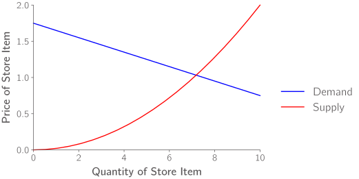

.. role:: boldblue
   :class: boldblue

.. role:: captiontext
   :class: captiontext

.. role:: analysisgreen
    :class: analysisgreen

.. role:: optblue
    :class: optblue

===================================
Formulating an Optimization Problem
===================================

-----------------
General Procedure
-----------------

Now that you have been introduced to :boldblue:`objective functions`, :boldblue:`design variables`, and :boldblue:`constraints` in detail, the next step is understanding how to combine these concepts to create an optimization problem. First, recall these three key definitions:

- Objective function: the mathematical function to be minimized (or maximized)
- Constraints: limits on design variables and other quantities of interest
- Design variables: choices that directly influence the value of the objective function

:boldblue:`It is important to note that there is more than one way to go about formulating an optimization problem`. However, here we are going to provide one approach that can serve as a guide while you are getting started. 

Broadly, the major steps in formulating an optimization problem are listed below.

.. figure:: images/Formulating/1_OptProblemSteps.svg
    :figwidth: 100 %
    :alt: template for formulating an optimization problem
    :align: center

    :captiontext:`Template for Formulating an Optimization Problem`

    ..

.. dropdown:: Key Idea: What if I have more than one quantity that contributes to my objective function? 
    :icon: light-bulb

    For now, we are only going to focus on optimization problems with a single objective function, but there are techniques for performing :boldblue:`multi-objective optimization`. For :boldblue:`single-objective optimization`, the objective function we define can be quantified by an individual scalar value. The topic of multi-objective optimization is bit more advanced and will be discussed in a future section.

One way to assist with the process of formulating an optimization problem is with an :boldblue:`eXtended Design Structure Matrix (XDSM) diagram`! This is a tool that helps illustrate the flow of information between different parts of your problem. To understand how this diagram works, consider the example below that highlights the different components. 

.. figure:: images/Formulating/2_XDSMDescription_v2.png
    :scale: 5 %
    :alt: example of an XDSM diagram
    :align: center

    :captiontext:`Example eXtended Design Strucutre Matrix (XDSM) Diagram`

    ..

This is a generic optimization problem to describe the basic concepts of an XDSM diagram. The rectangular components along the main diagonal with the green backgrounds represent the main analysis blocks within the system. Within these analyses, outputs of interest, such as the objective function, are computed given some inputs. Inputs to each analysis block are depicted with vertical, grey lines, and this is true whether the input is above or below the analysis block. The inputs to each discipline can either be outputs from another discipline or fixed inputs to the system. For example, :analysisgreen:`Analysis Block 2` has two inputs: :math:`y_1`, which is an output from :analysisgreen:`Analysis Block 1`, and :math:`c_2`, a fixed input to the system. All the outputs of a given analysis block are connected by horizontal, grey lines, and here the outputs are :math:`y_1` and :math:`y_2`. The analysis procedure for this system consists of the :analysisgreen:`green` blocks, but an :optblue:`Optimizer`, shown with a :optblue:`blue` oval, exists at the top-level of the model. The :optblue:`Optimizer` controls the design variables for the system, :math:`x`, which are provided as inputs in this example to the first analysis block. After performing the analysis for a given set of design variables, the outputs of interest are provided back to the :optblue:`Optimizer`, which updates the design variables in a manner to improve the objective function. The process for the optimization is depicted in the XDSM diagram with the black arrow, which further indicates the key steps in the optimization procedure. Once the :optblue:`Optimizer` converges to a solution, it returns the optimal output values, :math:`y_1^\ast,\ y_2^\ast`, and the optimal design variables, :math:`x^\ast`, which are all indicated with a “star”.

.. dropdown:: Key Idea: what's the difference between inputs above and below analysis blocks?
    :icon: light-bulb

    If the input is below the analysis block, then this indicates that there is an implicit relationship between these two disciplines, which means that an input to this discipline is computed later or downstream of the current discipline. These implicit inputs have to be determined by implementing some solver procedure or continuously iterating until the value no longer changes.

-----------------------
Real-world Applications
-----------------------

Now that the procedure for formulating an optimization problem has been introduced and you understand the basics, you may be wondering how optimization can be used for real-world applications. Here are a few examples of how optimization has been used in a variety of disciplines.

#####################################
Rocket to International Space Station
#####################################

    :captiontext:`SpaceX Dragon Capsule Docking with the International Space Station (Credit - SpaceX/NASA [1])`

Consider that you are an engineer working for a space company tasked with designing a new rocket to carry cargo, such as food and science experiments, to the International Space Station (ISS). Launching rockets and sending supplies to the ISS is expensive, so as an engineer your objective is to maximize the cargo weight that you can carry for a single mission. There are also some constraints that you will have to consider, such as a minimum value possible for the volume that the cargo occupies on the rocket and the efficiency of the fuel that is used. Then, if you are working on designing the space capsule, the design variables, :math:`x`, that you may have control over include the shape of the capsule and some of the materials used. This forms the core of your optimization problem for maximizing the cargo sent to the ISS! Mathematically, this might be represented as the following, where the vertical dots indicate that there are other constraints that could be considered.

.. figure:: images/Formulating/4_OptRocketStatement.svg
    :scale: 110 %
    :alt: Optimization statement for rocket example
    :align: center

    :captiontext:`Optimization Statement for Example Problem on  Rocket Design`

    ..

#####################
Grocery Store Pricing
#####################

    :captiontext:`Sample Supply and Demand Curves for Grocery Store Pricing`

Now imagine that you are at the grocery store shopping for your favorite snacks. Have you ever thought about how the prices are set for what you buy? From the supermarket operations side, the task of setting the prices for grocery store items is an optimization problem. As a company, one objective might be to maximize profit, which is the total amount of money made minus expenses. One way to do this is to make all the items expensive to increase the profit margin. However, if this is done, you, as a shopper, would go to another store to buy your snacks. So, a constraint that must be satisfied is that the prices set must be be less than or equal to those of a competing store. Keeping this constraint among others in mind, the grocery store controls the prices of their goods, which are their design variables. In economics, this problem is often thought about in terms of supply and demand curves, where the optimal point is the intersection of the two curves! 

.. figure:: images/Formulating/6_OptGroceriesStatement.svg
    :scale: 80 %
    :alt: Optimization statement for grocery store pricing example
    :align: center

    :captiontext:`Optimization Statement for Example Problem on Grocery Store Pricing`

    ..

#######################
Traffic Junction Design
#######################

.. figure:: images/Formulating/7_GoldenGate.svg
    :figwidth: 100 %
    :scale: 50 %
    :alt: Golden Gate bridge in San Francisco
    :align: center
    :target: https://www.cnn.com/travel/article/most-amazing-bridges/index.html

    :captiontext:`Golden Gate Bridge in San Francisco (Credit - CNN [2])`

One final example to consider is that you are a civil engineer trying to design a new traffic junction over a river. Since the vehicles must travel over water, you need to design a bridge with the objective of maximizing traffic flow. While adding many lanes would help with traffic flow, you have a strict budget, or monetary constraint. Additionally, you must ensure that the bridge is capable of holding a minimum weight in case there is a traffic jam. This adds an additional structural constraint where the load of the cars on the bridge must be less than or equal to a maximum allowable load. Your design variables in this instance would then be the number of lanes, the geometry of the bridge, and the materials that you use. If you have ever heard of the video game Poly Bridge, this concept might sound familiar! 

.. figure:: images/Formulating/8_OptBridgeStatement.svg
    :scale: 70 %
    :alt: Optimization statement for traffic junction example
    :align: center

    :captiontext:`Optimization Statement for Example Problem on Traffic Junction Design`

    ..

To learn more about how to perform optimization on your own numerical problems and utilize the concepts you have learned in this introductory section, keep reading the following sections to see optimization in action!

----------------
Image References
----------------

.. TODO: update the image citation to be real citations

[1] `SpaceX Dragon Capsule Docking <https://www.cnn.com/2019/03/03/tech/spacex-crew-dragon-docking-international-space-station/index.html>`_

[2] `Golden Gate Bridge <https://www.cnn.com/travel/article/most-amazing-bridges/index.html>`_