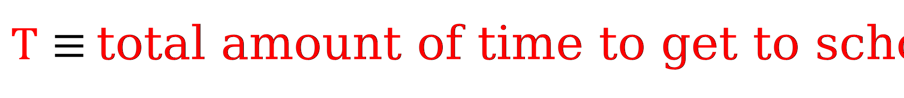
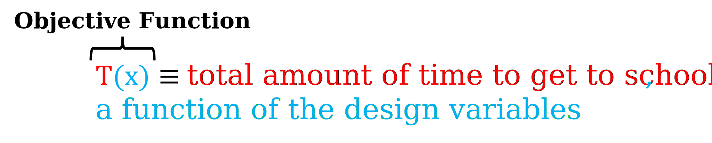
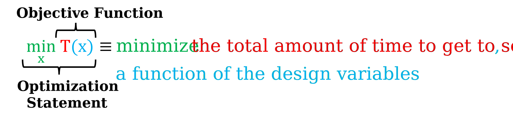
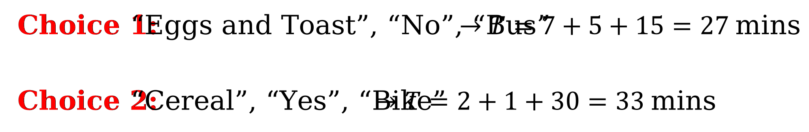

.. role:: boldblue
   :class: boldblue

.. role:: captiontext
   :class: captiontext

===================
Objective Functions
===================

Now that you have an introduction to optimization and have learned some of the key history behind its development, let’s discuss one of the most important pieces of any optimization problem: the :boldblue:`objective function`.

No matter the discipline or field, an objective function is a core component of every optimization problem. :boldblue:`Qualitatively, one way to think of an objective function is that it is a goal or a target that you are trying to achieve`. 

Let’s start  with a simple  example to give a clearer idea as to what an objective function is. Consider this scenario: it’s Monday morning, and the school day starts at 8 AM. Your goal, or objective, is to make it to school on time! This is an example of a :boldblue:`Boolean objective` because there are two ways to answer the question about whether you made it to school on time: *true* or *false*.  

While making it to school on time is important, this scenario can be reframed to further illustrate some additional optimization principles.  Another way to think about the commute to school is that you want to take as little time as possible in the morning from when you wake up until you arrive at school. Then, this allows you to sleep longer in the morning to make sure you are well rested for all your classes. 

In this new scenario, the goal, or objective function, is the total amount of time that it takes to get to school, and this is the quantity to minimize. This is an example of a :boldblue:`continuous objective` since the time it takes to get to school is contained within a range of different values. 

The trip to school will often take between 30 minutes to 1 hour, but it could take longer or shorter depending on traffic and other factors. Without adding any :boldblue:`constraints`, which places limits on quantities of interest like the time it takes to get to school, there is technically no limit to how short of a time it takes you to get to school, but this would also require you to invent teleportation or stop time! While we are not focused on constraints here, you can learn more about constraints and their role in optimization in the next section.

Most often in numerical optimization, the objective function is created in such a way that it is a quantitative value or number that can be minimized. This is the convention in optimization, but one can easily maximize a function using the same techniques by minimizing the negative of the function. 

Going back to our second example, where we want to minimize the total time it takes to get to school, let’s introduce some mathematical terminology for how to represent objective functions in optimization. 

Here, :math:`T` represents the function that determines how much time it takes to get to school once you wake up. 

.. Note the extra .. after caption text is important to void a legend entry


   :captiontext:`Objective Function for Example Problem`

   ..

Thinking about your own actions to get to school in the morning, the amount of time is dependent on, or a function of, factors like the mode of transportation you take, what you are going to make for breakfast, and whether you picked out an outfit the night before. These things are called the :boldblue:`design variables` for your problem, and they directly influence the amount of time it takes to get to school. 

Let’s  represent these design variables as :math:`x`, which is an array that contains all of the design variables in the problem. Now, the objective function can be rewritten as shown below.



   :captiontext:`Objective Function as Influenced by the Design variables for Example Problem`

   ..

Finally, since we want to minimize the total time it takes to get to school, the objective function and optimization statement are officially written as:



   :captiontext:`Optimization Statement for Example Problem`

   ..

From a notation point of view, the :math:`x` below the word “min” means that we are changing the design variables to minimize our objective function of interest. 

Now that we have defined the problem, consider three design variables that influence the amount of time it takes to get to school: what to cook for breakfast, whether an outfit was picked out the night before, and the mode of transportation to get to school. For simplicity, each set of design variables will be denoted by the predetermined options inside the curly braces {}. Next to each choice in the set, the number of minutes that each option adds to the objective function is given. 


   :captiontext:`Design Variables for Example Problem`

   ..

Using these sets of design variables, we can choose a couple of combinations to consider the total amount of time it takes to get to school. 



   :captiontext:`Sample Design Variable Choices for Example Problem`
   
   ..

From these two choices, Choice 1 is better than Choice 2 since it is six minutes faster! However, while Choice 1 is the shortest of these two options, is it truly the best? Can you find a better choice using the sets above? Click the drop down to see the answer for this example. 

.. dropdown:: What is the optimal choice of design variables for this example? 
   :icon: question

   Looking back at the design variable sets above, it is apparent that a choice can be made that results in a shorter amount of time than Choices 1 and 2. With this choice for the design variables, the total amount of time it would take to get to school is 13 minutes, which is the optimal time in this scenario!  

   .. figure:: images/ObjectiveFunctions/6_OptimalChoice.svg
      :figwidth: 100 %
      :scale: 15 %
      :alt: optimal choice of design variables for example problem
      :align: center

      :captiontext:`Optimal Design Variable Choice for Example Problem`

      ..

In this simple example, since each choice does not influence the others at all, the minimum amount of time can be determined by minimizing each contribution in the three sets above. If another design variable were added to the problem, such as exercising in the morning, then minimizing the time associated with this choice and adding it to the time from the optimal set above would still minimize the problem. *In more complicated, realistic applications, the design variables and their impact on the objective function might be coupled, so it may be difficult to say by observation what is in the optimum set*. To learn how to solve these more complicated and general problems, keep reading the sections ahead! 

Key Takeaways:
```````````````
- An objective function can be thought of as a target or goal that you are trying to achieve, and quantitatively it is a number that we want to minimize

- There are different types of objective functions, and the objective that you choose is dependent on your problem 

- Design variables are quantities or choices that you can make that influence the value of your objective function

Definitions:
`````````````

- Objective function: the mathematical function that you are trying to minimize (or maximize)

- Constraints: limits on quantities of interest, such as design variables or objective function values (see next section for more details)

- Design variables: choices you make for factors that directly influence the value of the objective function