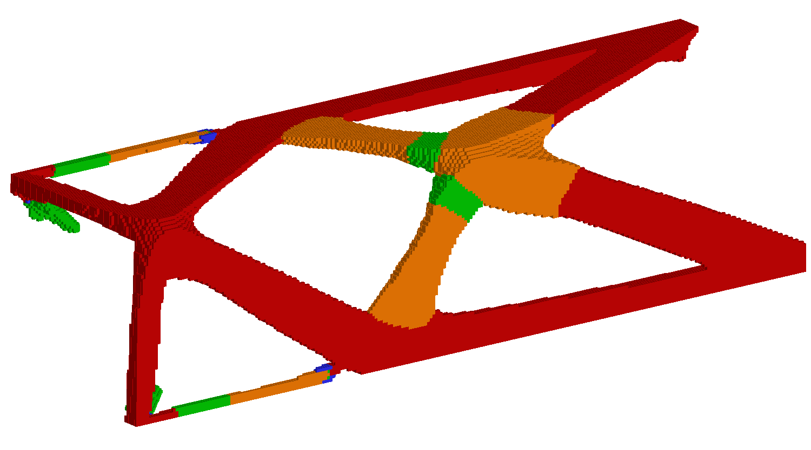
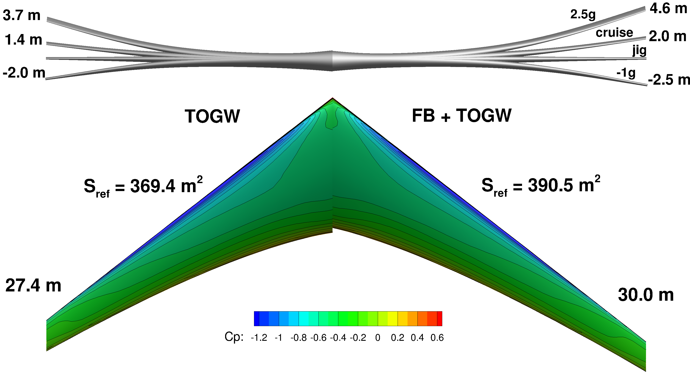

=================
Research projects
=================

Simulation-based design optimization has the potential to dramatically improve the design of aerospace vehicles over the next decade. Many aerospace vehicles operate under conditions which are governed by multiple disciplines that interact in highly nonlinear ways. For instance, flexible wings that deform under aerodynamic loads are governed simultaneously by both aerodynamics and structural dynamics, two disciplines that must be tightly coupled to obtain the true flying wing shape and, in turn, evaluate the performance of the aircraft. Multidisciplinary design optimization (MDO) methods are designed to address concurrently the difficulty of coupled analysis and integrated design using sophisticated numerical methods. First developed over 20 years ago, MDO techniques have matured significantly over the past decade. Low-fidelity MDO methods are now routinely used by industry in preliminary design optimization however, these tools frequently rely on empirical models that have fundamental limitations. High-fidelity, physics-based simulation can overcome these limitations, but significant research challenges remain to reduce the computational cost and increase the robustness of MDO techniques applied to high-fidelity models.

The goal of my research is to develop new MDO methods and techniques for high-fidelity simulations that can be used in a time-critical design cycle in industry applications. My research applications focus on aircraft design, however, I also hope to make contributions to applications of MDO in other aerospace-related fields. My research focuses on three areas in which new developments will have an important impact on the design optimization process, and in turn, on the performance of future generations of aircraft: high-performance computing (HPC) for design optimization, analysis and design optimization of unsteady aeroelastic phenomena, and optimization of composite structures.

Optimization using high-fidelity simulations typically require thousands of times the computational resources of high-fidelity simulations alone. Therefore, developing algorithms that make effective use of HPC resources is essential to obtain results within a 12 to 24 hour time frame that is practical for industrial design applications. Unsteady aeroelastic phenomena are becoming more important in the aircraft design problem as advanced structural materials enable lighter, more flexible aircraft. Developing new design methods to incorporate these design constraints into high-fidelity aircraft optimization problems will maximize the use of both passive and active load alleviation, and avoid costly late-stage design modifications. Composite materials have the potential to enable significant weight savings by giving the design engineer greater freedom to tailor structures to meet stringent design requirements. However, the design of composite structures is often complicated by the addition of manufacturing constraints. These manufacturing constraints place an additional level of complexity on the structural design and are frequently challenging to formulate in a manner compatible with efficient optimization methods. Advances in these areas of high-fidelity simulation-based MDO have the potential to significantly improve the performance of the next generation of aerospace vehicles.

FUNtoFEM
========

Aerospace vehicles often operate in high-temperature conditions or at high Mach numbers and are subject to both aerodynamic heating and loads. 
Aerothermoelastic analysis and optimization of these vehicles is required when there is tight coupling between the aerodynamic flow, thermal 
response of the vehicle and the elastic deformation of the aerodynamic surfaces. In this work, we use the FUNtoFEM framework that is implemented 
for coupled aerothermoelastic analysis and adjoint- based gradient evaluation. Coupled multidisciplinary design of aerothermoelastic systems using 
freeform deformation geometry parametrizations does not offer the required flexibility to simultaneously tailor both the internal structural geometry 
and layout and outer mold line. To address this deficiency, FUNtoFEM is integrated with ESP/CAPS, a differentiable CAD tool with support for 
multidisciplinary aircraft geometries.

Large-scale topology optimization
=================================

Aerospace vehicles utilize slender, high-aspect ratio structures with small material volume fractions to achieve high stiffness-to-mass and strength-to-mass ratios. Optimization of these structures using topology optimization is challenging due to the demanding mesh requirements and large size of the design problem which scales in proportion to the analysis problem. We have addressed these difficulties by using a scalable framework for analysis and design of large-scale topology and multimaterial optimization problems. This framework includes a multigrid method for solving large structural finite-element problems, and a parallel design optimization framework for solving large-scale optimization problems.

.. youtube:: EOxX892yg5g 
   :width: 800

The video above shows the convergence history of a large multimaterial structural optimization problem solved using both parallel analysis and parallel design optimization methods developed by our group. The solution of this large-scale design problem would not be possible within a practical time frame without the efficient use of high-performance parallel computing resources.

.. image:: images/project_topology_2.png
   :width: 600 px
   :align: center

To make this design into a physical structural component, we can use additive manufacturing, also known as 3D printing. In this case, we remove the specification of different materials, and concentrate on the manufacturing process with the given geometry. To manufacture the structure, we create a representation of the model that is compatible with additive manufacturing tools. For this purpose, we generate an .stl file in a post processing step from the voxel-based description of the structure used during optimization. More information on the .stl file format can be found here_. After this post-processing step, the part can be manufactured using additive manufacturing techniques. Thanks to Justin Gray for printing this sample part!

.. _here: http://www.ennex.com/~fabbers/StL.asp

.. image:: images/project_topology_3.jpg
   :width: 200 px
   :align: center

The objective of this research is to close the gap between methods used to parametrize the structure for design optimization and the manufacturing process itself in order to achieve higher-performance structures that meet all design requirements.

Aeroelastic optimization
========================

Advanced materials with greater strength and stiffness enable the use of slender, higher-aspect ratio wings that are aerodynamically favorable but exhibit greater flexibility than conventional wings. Even at an early stage of the design process, it is important to model the effects of wing flexibility using aeroelastic analysis. While dynamic aeroelastic phenomena are often critical in the design of wings, especially in the transonic regime, our focus is often on static aeroelastic analysis, called aerostructural analysis. We utilize detailed structural models that can be used to accurately size the structure for strength and buckling constraints, to predict structural weight, and to compute aerostructural deflections. These detailed structural models often include sophisticated structural design parametrizations for advanced materials. As a result, the full aerostructural design space may have thousands of design variables. To handle these large design problems in an efficient manner, we use gradient-based design optimization methods with an efficient coupled adjoint implementation that can be used to evaluate the derivative with respect to thousands of design variables in a reasonable computational time.

Optimization of composite structures
====================================

.. image:: images/project_composite.png
   :width: 600 px
   :align: center

The parametrization of laminated composite structures for design optimization is a challenging problem. Manufacturing requirements limit the freedom to tailor composite structures to meet demanding performance requirements. Often, these manufacturing requirements are modeled by limiting the allowable ply angles to a discrete set of values. This discrete problem is not, in its most natural form, amenable to gradient-based optimization. On the other hand, methods for nonlinear mixed-integer programming are almost inevitably computationally expensive, especially for large design spaces. In our work, we use laminate parametrizations that take into account the discrete nature of the ply angles. To avoid solving a large, nonlinear, mixed-integer program, we use relaxation methods where the original discrete problem is transformed into a continuous analogue of the original problem. We then obtain solutions to the modified problem using gradient-based optimization.
